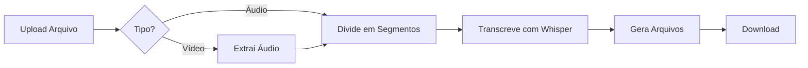

# 🎵 Transcriber - Transcritor Automático de Áudio/Vídeo

<div align="center">


**Interface web moderna para converter vídeos em áudio, dividir em segmentos e transcrever automaticamente usando IA**

</div>

---

## 📸 Interface


---

## 🎯 O que faz?

O **Transcriber** é uma aplicação web que automatiza o processo de transcrição de áudio e vídeo:

1. **📹 Aceita Vídeos**: MP4, AVI, MOV, MKV, FLV, WMV, WEBM, M4V, MPG, MPEG
2. **🎵 Aceita Áudios**: MP3, WAV, M4A, AAC, FLAC, OGG, WMA
3. **🔄 Converte Automaticamente**: Extrai áudio de vídeos
4. **✂️ Divide em Segmentos**: Quebra em partes menores (configurável)
5. **🤖 Transcreve com IA**: Usa Whisper (OpenAI) para gerar texto
6. **📄 Salva Resultados**: Transcrição completa + detalhada

### ✨ Características Principais

- 🖱️ **Interface Drag-and-Drop**: Arraste arquivos para processar
- 🎥 **Suporte a Vídeos**: Converte automaticamente para áudio
- 🤖 **5 Modelos Whisper**: De rápido (tiny) a preciso (large)
- 📊 **Progress Bar em Tempo Real**: Acompanhe o processamento
- 💾 **Salvamento Incremental**: Não perde progresso se interromper
- ⬇️ **Download Facilitado**: Baixe transcrições individuais ou ZIP completo
- 🌐 **100% Python**: Streamlit + MoviePy + Whisper

---

## 🚀 Instalação

### Pré-requisitos

- Python 3.13+
- pip (gerenciador de pacotes)
- ffmpeg (para conversão de vídeo)

### Passo a Passo

1. **Clone o repositório**

   ```bash
   git clone https://github.com/ramon141/transcriber
   cd transcriber
   ```
2. **Crie um ambiente virtual**

   ```bash
   python3 -m venv venv
   source venv/bin/activate  # Linux/Mac
   # ou
   venv\Scripts\activate     # Windows
   ```
3. **Instale as dependências**

   ```bash
   pip install -r requirements.txt
   ```
4. **Inicie a aplicação**

   ```bash
   source venv/bin/activate && STREAMLIT_BROWSER_GATHER_USAGE_STATS=false streamlit run streamlit_app.py --server.headless=true
   ```
5. **Acesse no navegador**

   - Abre automaticamente em: `http://localhost:8501`
   - Ou acesse manualmente este endereço

---

## 📖 Como Usar

### 1️⃣ Configure na Barra Lateral

**Modelo de Transcrição:**

- **tiny**: Mais rápido (~1.4 min por min de áudio) - Qualidade básica
- **base**: Balanceado (~2-3 min por min) - **✅ Recomendado**
- **small**: Boa qualidade (~3-4 min por min)
- **medium**: Alta qualidade (~4-5 min por min)
- **large**: Melhor qualidade (~5-6 min por min) - Muito lento

**Duração dos Segmentos:**

- 1 a 10 minutos (padrão: 4 minutos)
- Segmentos menores = processamento mais rápido
- Segmentos maiores = menos arquivos gerados

### 2️⃣ Carregue o Arquivo

- **Arraste** o arquivo para a área de upload
- **Ou clique** para selecionar do computador
- Limite de 500MB por arquivo

### 3️⃣ Processe

1. Clique em **"🚀 Processar Áudio"**
2. Acompanhe o progresso em tempo real
3. Aguarde a conclusão

### 4️⃣ Baixe os Resultados

**Aba "📄 Transcrição Completa":**

- Visualize o texto completo
- Copie diretamente da interface

**Aba "📁 Segmentos":**

- Veja transcrições por segmento
- Timestamps para cada parte

**Aba "⬇️ Downloads":**

- Baixe transcrição completa (.txt)
- Baixe transcrição detalhada (.txt)
- Baixe ZIP com tudo (áudios + transcrições)

---

## 🎬 Fluxo de Processamento



**Exemplo Prático:**

```
Entrada: video_aula.mp4 (1 hora)
         ↓
Extração: video_aula.wav
         ↓
Divisão: 15 segmentos de 4 minutos
         ↓
Transcrição: Whisper processa cada segmento
         ↓
Saída:
  - video_aula_transcricao_completa.txt
  - video_aula_transcricao_detalhada.txt
  - 15 arquivos de áudio (M4A)
```

---

## 📊 Estrutura de Saída

```
arquivo_original_dividido/
├── arquivo_original_parte_01.m4a
├── arquivo_original_parte_02.m4a
├── arquivo_original_parte_03.m4a
├── ...
├── arquivo_original_transcricao_completa.txt
└── arquivo_original_transcricao_detalhada.txt
```

**Transcrição Completa:**

```
🎵 TRANSCRIÇÃO COMPLETA DO ÁUDIO
==================================================

Arquivo original: video_aula.mp4
Total de segmentos: 15
Duração total: 3600.0 segundos
Status: ✅ COMPLETO - 15/15 segmentos transcritos

==================================================

[01] Bem-vindos à aula de hoje...
[02] Vamos começar falando sobre...
[03] O conceito principal é...
...
```

---

## ⏱️ Tempos de Processamento

### Por Modelo (1 hora de áudio)

| Modelo           | Tempo Estimado | Qualidade    | Recomendação       |
| ---------------- | -------------- | ------------ | -------------------- |
| **tiny**   | ~1-2 horas     | ⭐⭐         | Testes rápidos      |
| **base**   | ~2-3 horas     | ⭐⭐⭐       | ✅ Uso geral         |
| **small**  | ~3-4 horas     | ⭐⭐⭐⭐     | Conteúdo importante |
| **medium** | ~4-5 horas     | ⭐⭐⭐⭐⭐   | Alta qualidade       |
| **large**  | ~5-6 horas     | ⭐⭐⭐⭐⭐⭐ | Máxima precisão    |

### Dicas de Performance

**Para Arquivos Pequenos (< 30 min):**

- Modelo: `base` ou `small`
- Segmentos: 4-5 minutos

**Para Arquivos Grandes (> 1 hora):**

- Modelo: `tiny` (velocidade) ou `base` (qualidade)
- Segmentos: 2-3 minutos
- Salvamento incremental evita perda de dados

**Para Vídeos:**

- Primeira conversão para áudio pode demorar
- Após conversão, processamento segue normal
- Vídeos HD podem ter áudio pesado

---

## 🎯 Casos de Uso

### 📹 Transcrever Aulas Gravadas

```
Upload: aula_gravada.mp4
Modelo: base
Resultado: Transcrição completa da aula
Tempo: ~2-3x a duração do vídeo
```

### 🎙️ Transcrever Podcasts

```
Upload: podcast_ep05.mp3
Modelo: small
Resultado: Texto do episódio completo
Tempo: ~3-4x a duração do áudio
```

### 📺 Legendar Vídeos

```
Upload: video_youtube.mp4
Modelo: base
Resultado: Texto para criar legendas
Tempo: ~2-3x a duração do vídeo
```

### 📝 Documentar Reuniões

```
Upload: reuniao_gravada.m4a
Modelo: base
Resultado: Ata da reunião em texto
Tempo: ~2-3x a duração da reunião
```

---

## 🔧 Solução de Problemas

### ❌ Erro: "Module 'streamlit' not found"

```bash
pip install streamlit>=1.28.0
```

### ❌ Erro: "Module 'moviepy' not found"

```bash
pip install moviepy>=1.0.3
```

### ❌ Erro na conversão de vídeo

- Verifique se o ffmpeg está instalado
- Mac: `brew install ffmpeg`
- Ubuntu: `sudo apt install ffmpeg`
- Windows: [Baixe aqui](https://ffmpeg.org/download.html)

### ❌ Porta 8501 já em uso

```bash
streamlit run streamlit_app.py --server.port 8502
```

### ❌ Arquivo muito grande (>500MB)

- Divida o arquivo antes de processar
- Use ferramentas de corte de vídeo
- Ou reduza a qualidade do vídeo

### ❌ Modelo Whisper não carrega

- **Primeira vez**: Faz download automático (internet necessária)
- **Espaço em disco**: Modelos ocupam 100MB a 3GB
- **Tente modelo menor**: Comece com `tiny` ou `base`

### ❌ Transcrição vazia ou ruim

- **Áudio instrumental**: Whisper só transcreve fala
- **Áudio com ruído**: Use modelo `small` ou superior
- **Idioma errado**: Sistema usa português por padrão
- **Volume baixo**: Normalize o áudio antes

### ❌ Processamento interrompido

- **Não se preocupe!** Salvamento incremental preserva progresso
- Verifique a pasta de saída - transcrições parciais estão salvas
- Abra o arquivo `_transcricao_completa.txt` para ver o que foi processado

---

## 🛠️ Arquitetura Técnica

### Componentes

```
transcriber/
├── streamlit_app.py          # Interface web (frontend + lógica)
├── audio_processor.py         # Processamento de áudio/vídeo
├── split_audio.py             # Funções core (dividir, transcrever)
├── requirements.txt           # Dependências Python
└── .streamlit/
    └── config.toml            # Configurações do Streamlit
```

### Tecnologias

- **[Streamlit](https://streamlit.io/)**: Framework web Python
- **[Whisper](https://github.com/openai/whisper)**: IA de transcrição (OpenAI)
- **[MoviePy](https://zulko.github.io/moviepy/)**: Processamento de vídeo
- **[librosa](https://librosa.org/)**: Análise de áudio
- **[pydub](https://github.com/jiaaro/pydub)**: Manipulação de áudio

### Fluxo de Dados

1. **Upload** → Streamlit recebe arquivo
2. **Detecção** → Identifica se é vídeo ou áudio
3. **Conversão** (se vídeo) → MoviePy extrai áudio
4. **Divisão** → librosa divide em segmentos
5. **Transcrição** → Whisper processa cada segmento
6. **Salvamento** → Arquivos TXT criados incrementalmente
7. **Download** → Streamlit oferece arquivos para download

---

## 📄 Licença

Este projeto está sob a licença MIT. Veja o arquivo [LICENSE](LICENSE) para mais detalhes.

---

## 👨‍💻 Autor

**Ramon**

- GitHub: [@ramon141](https://github.com/ramon141)

---

## 🙏 Agradecimentos

- [OpenAI Whisper](https://github.com/openai/whisper) - Modelo de IA de transcrição
- [Streamlit](https://streamlit.io/) - Framework web Python
- [MoviePy](https://zulko.github.io/moviepy/) - Processamento de vídeo
- [librosa](https://librosa.org/) - Análise de áudio
- [soundfile](https://pysoundfile.readthedocs.io/) - Leitura/escrita de áudio

---

<div align="center">

**⭐ Se este projeto foi útil, considere dar uma estrela! ⭐**

Feito com ❤️ e Python

</div>
